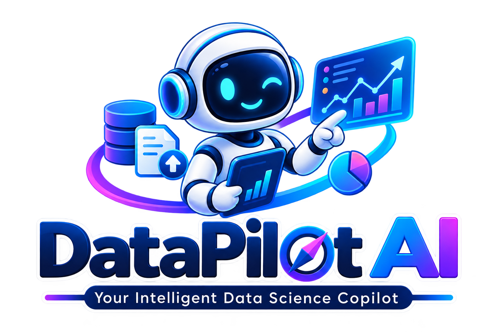

# 🚀 DataPilot AI

### Autonomous Data Preprocessing, Machine Learning & Prediction Platform



> **From Raw Data to Intelligent Predictions — Automatically.**

DataPilot AI is an intelligent end-to-end Data Science platform designed to simplify and automate the complete machine learning workflow.

The platform allows users to upload their datasets and transform raw data into actionable insights and predictive models through an interactive and intelligent workflow.

From data exploration and preprocessing to feature engineering, machine learning, model evaluation, prediction, and reporting, **DataPilot AI acts as an intelligent Data Science Copilot throughout the entire journey.**

---

## 🎯 Project Overview

Data Science workflows often require multiple technical steps, including:

* Understanding the dataset
* Cleaning missing or inconsistent data
* Detecting data types and distributions
* Performing exploratory data analysis
* Selecting appropriate preprocessing techniques
* Engineering useful features
* Choosing suitable machine learning models
* Training and evaluating models
* Comparing experiments
* Generating predictions
* Creating reports

**DataPilot AI brings all of these steps together into one intelligent platform.**

The system analyzes the uploaded dataset, provides recommendations, allows users to control the workflow, and supports the complete journey from **raw data to prediction**.

---

# ✨ Key Features

## 📤 Smart Dataset Upload

Upload datasets and automatically inspect:

* Dataset shape
* Number of rows and columns
* Column names
* Data types
* Missing values
* Duplicate records
* Numerical features
* Categorical features
* Potential target columns

Supported workflow is designed to make dataset exploration simple and interactive.

---

## 🔍 Automated Data Analysis

DataPilot AI automatically analyzes the dataset to identify important characteristics such as:

* Missing values
* Duplicate rows
* Data type inconsistencies
* Unique values
* Numerical distributions
* Categorical distributions
* Outliers
* Correlations
* Class imbalance

The platform provides a clear overview of the dataset before preprocessing begins.

---

## 🤖 Intelligent Recommendations

The system acts as a **Data Science Assistant** by recommending suitable next steps based on the uploaded dataset.

Examples include:

* Missing value handling strategies
* Encoding methods
* Scaling techniques
* Outlier treatment
* Feature selection recommendations
* Class imbalance handling
* Suitable machine learning algorithms

This helps guide users through the Data Science lifecycle, even when they are not experts.

---

## 🧹 Data Preprocessing

Perform preprocessing operations through an interactive interface.

Supported operations may include:

* Removing duplicates
* Handling missing values
* Dropping unnecessary columns
* Encoding categorical features
* Feature scaling
* Data type conversion
* Outlier detection and treatment
* Data transformation

Users can choose preprocessing strategies while the platform provides intelligent recommendations.

---

## 📊 Exploratory Data Analysis & Visualization

Generate powerful visualizations to better understand the dataset.

Available visualizations include:

* Histograms
* Bar charts
* Pie charts
* Box plots
* Scatter plots
* Line charts
* Correlation heatmaps
* Distribution plots
* Feature comparison charts

The visualization module helps transform raw data into meaningful insights.

---

## ⚙️ Feature Engineering

Improve machine learning performance by creating and transforming features.

Features include:

* Feature encoding
* Feature scaling
* Feature selection
* Feature transformation
* Derived feature creation
* Removing low-information features

---

## 🧠 Automated Machine Learning

DataPilot AI supports training multiple machine learning models depending on the selected problem type.

### Classification Models

* Logistic Regression
* Decision Tree Classifier
* Random Forest Classifier
* Support Vector Machine
* K-Nearest Neighbors
* XGBoost Classifier

### Regression Models

* Linear Regression
* Decision Tree Regressor
* Random Forest Regressor
* Support Vector Regressor
* XGBoost Regressor

The platform can automatically compare models and identify the best-performing solution.

---

## 🧪 Model Experiments

Compare multiple machine learning experiments in one place.

Track:

* Model name
* Training performance
* Testing performance
* Accuracy
* Precision
* Recall
* F1 Score
* MAE
* RMSE
* R² Score

This allows users to easily identify the best model for their dataset.

---

## 🔮 Prediction

After selecting and training the best model, users can generate predictions using new input data.

The trained pipeline can be reused without manually repeating preprocessing steps.

```text
New Data
    ↓
Preprocessing Pipeline
    ↓
Feature Transformation
    ↓
Trained Model
    ↓
Prediction
```

---

## 📄 Automated Reports

Generate reports summarizing the complete Data Science workflow.

Reports can include:

* Dataset overview
* Data quality analysis
* Missing values summary
* Preprocessing steps
* Visualizations
* Feature engineering operations
* Model performance
* Best model selection
* Final evaluation metrics

---

# 🔄 Platform Workflow

```text
🏠 Home
   ↓
📤 Upload Dataset
   ↓
🔍 Data Analysis
   ↓
🧹 Data Preprocessing
   ↓
📊 Visualization
   ↓
⚙️ Feature Engineering
   ↓
🤖 Machine Learning
   ↓
🧪 Experiments & Model Comparison
   ↓
🔮 Prediction
   ↓
📄 Reports
```

---

# 🏗️ Project Architecture

```text
DataPilot-AI/
│
├── 📄 App.py
│
├── 📁 pages/
│   ├── Home.py
│   ├── Upload.py
│   ├── Analysis.py
│   ├── Preprocessing.py
│   ├── Visualization.py
│   ├── Feature_Engineering.py
│   ├── Machine_Learning.py
│   ├── Experiments.py
│   ├── Prediction.py
│   ├── Reports.py
│   └── Our_Team.py
│
├── 📁 utils/
│   ├── data_loader.py
│   ├── analysis.py
│   ├── preprocessing.py
│   ├── visualization.py
│   ├── feature_engineering.py
│   ├── recommendation_engine.py
│   ├── model_training.py
│   ├── evaluation.py
│   └── prediction.py
│
├── 📁 src/
│   ├── helpers.py
│   ├── session_manager.py
│   └── pipeline_manager.py
│
├── 📁 styles/
│   └── main.css
│
├── 📁 assets/
│   └── images/
│       └── logo.png
│
├── 📁 data/
│
├── 📁 models/
│
├── 📄 requirements.txt
│
└── 📄 README.md
```

---

# 🛠️ Technologies Used

### Frontend & Application

* Python
* Streamlit
* HTML / CSS

### Data Analysis

* Pandas
* NumPy

### Data Visualization

* Matplotlib
* Plotly
* Seaborn

### Machine Learning

* Scikit-learn
* XGBoost

### Model Management

* Joblib

---

# 🚀 Getting Started

## 1️⃣ Clone the Repository

```bash
git clone https://github.com/your-username/DataPilot-AI.git
```

## 2️⃣ Navigate to the Project

```bash
cd DataPilot-AI
```

## 3️⃣ Create a Virtual Environment

```bash
python -m venv venv
```

### Windows

```bash
venv\Scripts\activate
```

### Linux / macOS

```bash
source venv/bin/activate
```

## 4️⃣ Install Dependencies

```bash
pip install -r requirements.txt
```

## 5️⃣ Run the Application

```bash
streamlit run App.py
```

The application will start locally in your browser.

---

# 📦 Requirements

Example dependencies:

```text
streamlit
pandas
numpy
scikit-learn
matplotlib
seaborn
plotly
xgboost
joblib
openpyxl
```

---

# 🎯 Supported Data Science Workflow

| Stage                  | Description                           |
| ---------------------- | ------------------------------------- |
| 📤 Upload              | Upload and inspect datasets           |
| 🔍 Analysis            | Understand data structure and quality |
| 🧹 Preprocessing       | Clean and prepare the dataset         |
| 📊 Visualization       | Generate interactive visualizations   |
| ⚙️ Feature Engineering | Transform and improve features        |
| 🤖 Machine Learning    | Train multiple ML models              |
| 🧪 Experiments         | Compare model performance             |
| 🔮 Prediction          | Generate predictions on new data      |
| 📄 Reports             | Export the complete analysis workflow |

---

# 💡 Project Vision

The goal of **DataPilot AI** is to make Data Science more accessible by reducing the complexity of the traditional machine learning workflow.

Instead of manually moving between multiple tools and writing repetitive preprocessing and training code, users can interact with a unified intelligent platform.

```text
Raw Dataset
     ↓
DataPilot AI
     ↓
Data Understanding
     ↓
Intelligent Recommendations
     ↓
Automated Preprocessing
     ↓
Visualization & Insights
     ↓
Feature Engineering
     ↓
Machine Learning
     ↓
Model Evaluation
     ↓
Best Model
     ↓
Predictions
```

---

# 🔮 Future Improvements

Future versions of DataPilot AI may include:

* 🤖 AI-powered Data Science Agent
* 💬 Natural Language interaction with datasets
* 📁 Support for more file formats
* ☁️ Cloud deployment
* 🔗 Database integration
* 🧬 Deep Learning models
* 🔄 Automated hyperparameter tuning
* 📊 Advanced AutoML capabilities
* 📝 PDF report generation
* 👥 User authentication and project management
* 🐳 Docker deployment

---

# 👨‍💻 Graduation Project

**DataPilot AI** was developed as a Graduation Project focused on building an intelligent platform that automates and simplifies the complete Data Science and Machine Learning lifecycle.

### 🚀 DataPilot AI

> **Upload. Analyze. Transform. Train. Predict.**

**Your Intelligent Data Science Copilot.**
